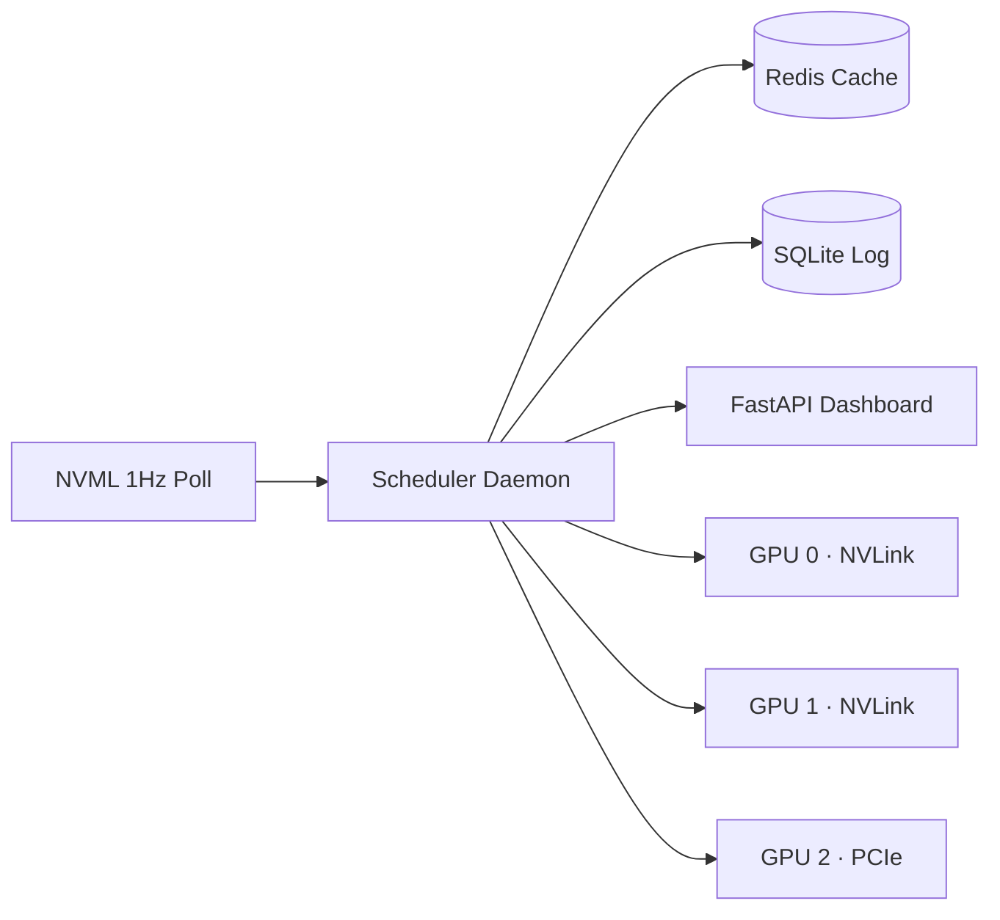

# VRAM Pressure: Scheduling Theory for Multi-GPU AI Workstations


My newer machines handle the heavy lifting now, but the first server I built — three RTX 3090, two on NVLink, 512 GB DDR4 — still runs five AI services daily. Modernizing its scheduling layer is what this write-up is about.

## Architecture



---

## The Hard Constraint

VRAM doesn't swap. A CPU process that exceeds RAM gets paged to disk — slow but alive. A CUDA process that exceeds VRAM gets killed. `CUDA error: out of memory` — no checkpoint, no recovery.

For GPU $g$ with total memory $M_g$ and allocated services $S_g$:

$$\sum_{s \in S_g} V_s \leq M_g \quad \forall \; t$$

where $V_s$ is the VRAM footprint of service $s$. A violation means a dead process. This is not a soft target. It's a kill condition.

The static assignment is solved once at boot. The harder question is what happens when a real-time request arrives and all GPUs are occupied.

---

## Bin Packing

Assigning $n$ services with VRAM requirements $v_1, \ldots, v_n$ to $k$ GPUs with capacities $c_1, \ldots, c_k$ is multiprocessor scheduling — NP-hard (Garey and Johnson, 1979). For three GPUs and five services, enumeration is trivial. The dynamics are not.

Services arrive and depart as a stochastic process. The relevant model is online bin packing with item departures (Coffman, Garey, and Johnson, 1980s; Balogh et al., 2017). The classic lower bound of $\frac{4}{3}$ on competitive ratio for online bin packing (Yao, 1980; refined by van Vliet, 1992, and Balogh, Békési, Galambos, 2012) establishes a floor — any online algorithm wastes at least 33% more capacity than an omniscient scheduler. The departures variant introduces additional fragmentation from vacated slots that are too small for waiting items. With three GPUs, even modest fragmentation eats into usable capacity.

Priority ordering determines who wins a GPU. The physical topology determines which GPU they should win.

---

## Priority Preemption

| Service | Priority | VRAM (GiB) | Latency Class |
|:--------|:--------:|----------:|:-------------|
| Whisper | 9 | 4 | real-time (< 2s) |
| TTS | 9 | 2 | real-time (< 1s) |
| Ollama | 8 | 20 | interactive (< 5s) |
| vLLM (70B, 4-bit AWQ) | 6 | 45 | batch |
| ComfyUI | 4 | 12 | batch |

Service with priority $p_h$ preempts service with priority $p_l$ iff $p_h > p_l$. Equal priority — FIFO, no preemption.

Preemption cost — evicting an LLM means losing the KV-cache:

$$C_{\text{preempt}} = T_{\text{shutdown}} + T_{\text{vram-free}} + T_{\text{startup}} + T_{\text{warmup}}$$

For Ollama on RTX 3090: $\approx 2s + 3s + 8s + 15s = 28s$ of dead time where neither service produces output.

Minimizing total preemption cost over horizon $T$:

$$\min \sum_{t=0}^{T} \sum_{(h,l) \in E(t)} C_{\text{preempt}}(h, l)$$

where $E(t)$ is the set of eviction events at time $t$. This is a weighted job scheduling problem with preemption penalties (Smith, 1956; Lawler, 1977).

---

## NVLink Topology

```
┌─────────┐  NVLink 3.0 (112 GB/s)  ┌─────────┐
│  GPU 0  ├──────────────────────────►│  GPU 1  │
│ 24 GiB  │                          │ 24 GiB  │
└────┬────┘                          └────┬────┘
     │ PCIe 4.0                           │ PCIe 4.0
     └──────────┐                ┌────────┘
                │                │
           ┌────┴────────────────┴─────┐
           │        PCIe Switch        │
           └────────────┬──────────────┘
                        │ PCIe 4.0
                   ┌────┴────┐
                   │  GPU 2  │
                   │ 24 GiB  │
                   └─────────┘
```

GPU 0 + GPU 1: NVLink 3.0 bridge — 56 GB/s per direction, 112 GB/s bidirectional. GPU 2: standalone, PCIe 4.0 x16 — 32 GB/s per direction, 64 GB/s bidirectional.

### Communication volume

Per transformer layer for tensor parallelism with hidden dimension $d_{\text{model}}$:

$$B_{\text{comm}} = 2 \cdot b \cdot s \cdot d_{\text{model}} \cdot \text{sizeof}(\text{dtype})$$

For a 70B model under 4-bit AWQ quantization ($d_{\text{model}} = 8192$), batch 1, sequence 2048, float16 activations:

$$B_{\text{comm}} = 2 \times 1 \times 2048 \times 8192 \times 2 = 67{,}108{,}864 \text{ bytes} = 64 \text{ MiB per layer}$$

With 80 layers: 5 GiB exchanged per forward pass. Using unidirectional throughput for consistent comparison — NVLink at 56 GB/s: 91 ms. PCIe at 32 GB/s: 160 ms. The 69 ms delta per inference makes NVLink the only viable path for interactive LLM serving with tensor parallelism.

### 70B model quantization note

A 70B parameter model at FP16 requires ~140 GiB. It fits in 45 GiB only under 4-bit quantization (AWQ or GPTQ), where each parameter occupies 4 bits plus quantization metadata. Two RTX 3090 cards provide 48 GiB total, minus ~800 MiB overhead each ≈ 46.4 GiB usable.

Hard constraint: $|\{s \in S_{\text{NVLink}} : \text{type}(s) = \text{LLM}\}| \leq 1$ — Ollama OR vLLM, never both.

Topology constrains placement. The remaining variable is how much memory is actually available.

---

## VRAM Budget

$$B_g = M_g - R_g - \sum_{s \in S_g} V_s$$

$M_g$ = 24,576 MiB (RTX 3090). $R_g$ = CUDA context overhead: 350–450 MiB per GPU (driver page tables, command buffers, ECC structures). Display connected: add 200–500 MiB.

Measured baselines (stable over six months):

| GPU | Baseline $R_g$ | Notes |
|:---:|----------:|:------|
| 0 | 412 MiB | headless |
| 1 | 398 MiB | headless |
| 2 | 623 MiB | display attached |

The scheduler records these at boot via `nvmlDeviceGetMemoryInfo` and uses them as ground truth — not hardcoded assumptions.

### NVML vs PyTorch

`nvmlDeviceGetMemoryInfo` returns `memory_reserved`, which includes PyTorch's `CUDACachingAllocator` pool. You can't allocate into another process's cached blocks. For scheduling, NVML's number is the correct one.

Service $s_{\text{new}}$ fits on GPU $g$ iff $V_{\text{new}} \leq B_g$. If no GPU satisfies this: real-time services trigger preemption, batch services enter the queue.

---

## Deadlock and Priority Inversion

Scenario: Ollama (priority 8) holds GPU 0+1, 40 GiB. vLLM (priority 6) requests start — can't preempt, enters queue. Waits indefinitely if the conversation runs for hours.

This is priority inversion (Sha, Rajkumar, and Lehoczky, 1990). The textbook solution — Priority Inheritance Protocol — doesn't transfer to GPU scheduling. PIP requires resource sharing within a single scheduler where a low-priority task holds a mutex that a high-priority task needs, and the protocol temporarily boosts the holder's priority. GPU memory allocation is binary: a service either holds its VRAM or it doesn't. There's no partial sharing, no mutex to inherit, no boost that would cause the holder to finish faster. The LLM doesn't run faster because something is waiting behind it.

Timeout-based escalation: if a queued service exceeds 300 seconds, the system raises an operator alert with the full blocking chain — which service holds which GPU, which queued service is waiting. No auto-eviction of higher-priority services. That would violate the priority hierarchy and create unpredictable cascading evictions.

EDF scheduling (Liu and Layland, 1973) is the theoretical alternative — optimal for uniprocessor. But the Dhall-Liu anomaly (1978) shows EDF achieves arbitrarily poor utilization on multiprocessor systems. With three GPUs, priority with manual override is more predictable.

---

## Thermal Coupling

GPU 1 (middle card) runs 8–12°C hotter than edge cards at the same load — sandwiched between two heat sources with restricted airflow. Thermal throttle at 83°C silently reduces clock speed, adding 15–20% inference latency.

Modified placement objective with thermal penalty:

$$T_{\text{penalty}}(g) = \max\left(0, \; T_g - T_{\text{threshold}}\right) \times \alpha$$

where $T_g$ is the current die temperature, $T_{\text{threshold}} = 78°C$ (5° below throttle), and $\alpha \approx 0.03$ on RTX 3090 (each degree above 78°C adds ~3% latency). The scheduler should prefer GPU $g$ that minimizes:

$$\text{cost}(g) = T_{\text{penalty}}(g) + \beta \cdot \frac{V_s}{B_g}$$

where $\beta$ weights VRAM pressure against thermal pressure. Not implemented — requires sub-second temperature telemetry integrated into the scheduling loop. The current NVML polling at 1s is too coarse for preemptive thermal migration.

---

## What Runs Now

The scheduler is a Python daemon managed by `systemd` — starts at boot, watches for USB hotplug events via `pyudev`, polls NVML at 1 Hz, serves a `FastAPI` endpoint for the web dashboard. `Redis` caches the current GPU state with a 5-second TTL. `SQLite` stores historical snapshots and the audit trail.

| Metric | Before | After |
|:-------|:------:|:-----:|
| Preemption events / day | ~12 | 3 |
| Whisper p95 latency | — | < 1.8s |
| ComfyUI → Ollama crashes | frequent | 0 (queued) |
| Scheduling crashes (6 months) | — | 0 |

---

## Hardware

- 3× NVIDIA RTX 3090 (24 GiB each, 72 GiB total)
- GPU 0 + GPU 1: NVLink 3.0 bridge (112 GB/s bidirectional)
- GPU 2: standalone, PCIe 4.0 x16 (64 GB/s bidirectional)
- 512 GB DDR4
- Ubuntu 22.04, CUDA 12.x

---

## References

1. Garey, M. R. and Johnson, D. S. *Computers and Intractability: A Guide to the Theory of NP-Completeness.* W. H. Freeman, 1979.
2. Yao, A. C. "New Algorithms for Bin Packing." *JACM*, 27(2), 1980.
3. van Vliet, A. "An Improved Lower Bound for On-Line Bin Packing Algorithms." *Information Processing Letters*, 43(5), 1992.
4. Balogh, J., Békési, J., and Galambos, G. "New Lower Bounds for Certain Classes of Bin Packing Algorithms." *Theoretical Computer Science*, 440–441, 2012.
5. Balogh, J. et al. "Online Bin Packing with Migration." *Algorithmica*, 2017.
6. Smith, W. E. "Various Optimizers for Single-Stage Production." *Naval Research Logistics Quarterly*, 3(1–2), 1956.
7. Lawler, E. L. "A 'Pseudopolynomial' Algorithm for Sequencing Jobs to Minimize Total Tardiness." *Annals of Discrete Mathematics*, 1, 1977.
8. Sha, L., Rajkumar, R., and Lehoczky, J. P. "Priority Inheritance Protocols: An Approach to Real-Time Synchronization." *IEEE Transactions on Computers*, 39(9), 1990.
9. Liu, C. L. and Layland, J. W. "Scheduling Algorithms for Multiprogramming in a Hard-Real-Time Environment." *JACM*, 20(1), 1973.
10. Dhall, S. K. and Liu, C. L. "On a Real-Time Scheduling Problem." *Operations Research*, 26(1), 1978.
11. Coffman, E. G., Garey, M. R., and Johnson, D. S. "Dynamic Bin Packing." *SIAM Journal on Computing*, 12(2), 1983.

---

GPU scheduling is job scheduling with a kill penalty instead of a swap penalty. That single difference — hard failure versus graceful degradation — changes every design decision from memory accounting to preemption policy to topology-aware placement. Everything else follows from the fact that VRAM doesn't forgive.

*3× RTX 3090 (2× NVLink), 512 GB RAM. Still in daily use.*
