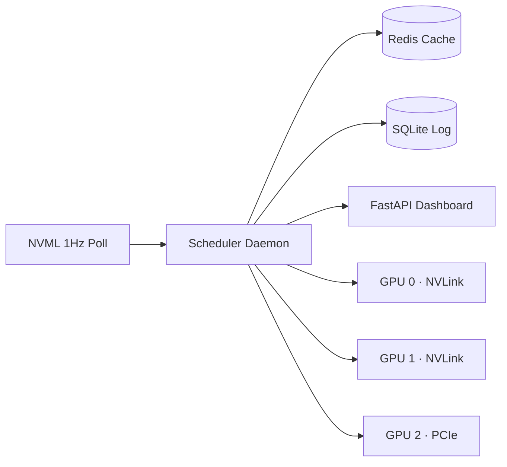

# VRAM Pressure: Scheduling Theory for Multi-GPU AI Workstations


A priority-preemptive, topology-aware GPU scheduler for multi-GPU AI workstations. Treats VRAM as a hard resource with a kill penalty instead of a swap penalty, which makes the whole design problem different from CPU scheduling. Runs in production on a 3-way RTX 3090 workstation with two cards NVLinked, serves five concurrent AI services, and has not crashed in six months.

This repository contains the theory, the design decisions, and the production results. The actual source code sits in a companion private repository referenced at the bottom.

## Architecture



## Why this is not a CPU scheduling problem

VRAM doesn't swap. A CPU process that exceeds RAM gets paged to disk, slow but alive. A CUDA process that exceeds VRAM gets killed. `CUDA error: out of memory`, no checkpoint, no recovery.

For GPU $g$ with total memory $M_g$ and allocated services $S_g$:

$$\sum_{s \in S_g} V_s \leq M_g \quad \forall \; t$$

where $V_s$ is the VRAM footprint of service $s$. A violation means a dead process. This is not a soft target. It's a kill condition.

That single property propagates into every design choice. Eviction decisions must be atomic. Memory accounting must be pessimistic. Placement must be provable before the first CUDA allocation, not discovered after.

## The design problem

Static assignment of long-running services to GPUs is solvable at boot by enumeration. The harder problem is the online one: real-time requests arrive at unpredictable times and expect GPU access within a latency budget while the machine is already saturated with batch work.

The formal model is online bin packing with item departures (Coffman, Garey, Johnson, 1983; Balogh et al., 2017). The classic lower bound on competitive ratio for online bin packing is $\frac{4}{3}$ (Yao, 1980; van Vliet, 1992; Balogh, Békési, Galambos, 2012). Any online algorithm wastes at least 33% more capacity than an omniscient scheduler. With three GPUs and heavy item variance (2 GiB TTS vs 45 GiB quantized LLM), even modest fragmentation eats into usable capacity.

Priority ordering determines who wins a GPU. Physical topology determines which GPU they should win. Both must happen in under 100 ms to stay below the real-time service SLA.

## Priority preemption

| Service | Priority | VRAM (GiB) | Latency class |
|:--------|:--------:|-----------:|:--------------|
| Whisper | 9 | 4 | real-time (< 2 s) |
| TTS | 9 | 2 | real-time (< 1 s) |
| Ollama | 8 | 20 | interactive (< 5 s) |
| vLLM (70B, 4-bit AWQ) | 6 | 45 | batch |
| ComfyUI | 4 | 12 | batch |

Service with priority $p_h$ preempts service with priority $p_l$ iff $p_h > p_l$. Equal priority falls back to FIFO, no preemption.

Preemption cost. Evicting an LLM means losing the KV-cache. For an Ollama instance on an RTX 3090:

$$C_{\text{preempt}} = T_{\text{shutdown}} + T_{\text{vram-free}} + T_{\text{startup}} + T_{\text{warmup}}$$

$$\approx 2\text{ s} + 3\text{ s} + 8\text{ s} + 15\text{ s} = 28\text{ s}$$

Dead time where neither service produces output. Minimizing total preemption cost over a horizon $T$:

$$\min \sum_{t=0}^{T} \sum_{(h,l) \in E(t)} C_{\text{preempt}}(h, l)$$

where $E(t)$ is the set of eviction events at time $t$. This is a weighted job scheduling problem with preemption penalties (Smith, 1956; Lawler, 1977).

## Scheduling algorithm

Placement on request. Pseudocode, no code:

```
procedure PLACE(service s with VRAM v, priority p):
    # Step 1: filter GPUs with enough free VRAM
    candidates <- [g for g in GPUS if free_vram(g) >= v]

    # Step 2: apply topology constraints
    if s.requires_nvlink:
        candidates <- [g for g in candidates if g in NVLINK_GROUP]
    if s.type == LLM and nvlink_has_llm():
        candidates <- [g for g in candidates if g not in NVLINK_GROUP]

    # Step 3: if candidates is empty, consider preemption
    if candidates is empty:
        victims <- [t for t in RUNNING if t.priority < p]
        if victims is empty:
            return QUEUED
        victim <- argmin(victims, by (C_preempt, time_running))
        EVICT(victim)
        g <- victim.gpu
    else:
        # Step 4: rank candidates by placement cost
        g <- argmin(candidates, by placement_cost(g, s))

    # Step 5: commit and log
    RESERVE(g, s, v)
    LOG_TRANSITION(s, g, reason)
    return g
```

Placement cost combines thermal, topology, and balance signals. See the cost function in the Thermal Coupling section.

## NVLink topology

```
┌─────────┐  NVLink 3.0 (112 GB/s)  ┌─────────┐
│  GPU 0  ├──────────────────────────►│  GPU 1  │
│ 24 GiB  │                          │ 24 GiB  │
└────┬────┘                          └────┬────┘
     │ PCIe 4.0                           │ PCIe 4.0
     └──────────┐                ┌────────┘
                │                │
           ┌────┴────────────────┴─────┐
           │        PCIe Switch        │
           └────────────┬──────────────┘
                        │ PCIe 4.0
                   ┌────┴────┐
                   │  GPU 2  │
                   │ 24 GiB  │
                   └─────────┘
```

GPU 0 and GPU 1: NVLink 3.0 bridge, 56 GB/s per direction, 112 GB/s bidirectional. GPU 2: standalone, PCIe 4.0 x16, 32 GB/s per direction, 64 GB/s bidirectional.

### Communication volume

Per transformer layer for tensor parallelism with hidden dimension $d_{\text{model}}$:

$$B_{\text{comm}} = 2 \cdot b \cdot s \cdot d_{\text{model}} \cdot \text{sizeof}(\text{dtype})$$

For a 70B model under 4-bit AWQ quantization ($d_{\text{model}} = 8192$), batch 1, sequence 2048, float16 activations:

$$B_{\text{comm}} = 2 \times 1 \times 2048 \times 8192 \times 2 = 67{,}108{,}864 \text{ bytes} = 64 \text{ MiB per layer}$$

With 80 layers: 5 GiB exchanged per forward pass. Using unidirectional throughput for consistent comparison, NVLink at 56 GB/s: 91 ms. PCIe at 32 GB/s: 160 ms. The 69 ms delta per inference makes NVLink the only viable path for interactive LLM serving with tensor parallelism.

### 70B model quantization note

A 70B parameter model at FP16 requires ~140 GiB. It fits in 45 GiB only under 4-bit quantization (AWQ or GPTQ), where each parameter occupies 4 bits plus quantization metadata. Two RTX 3090 cards provide 48 GiB total, minus ~800 MiB overhead each ≈ 46.4 GiB usable.

Hard constraint: $|\{s \in S_{\text{NVLink}} : \text{type}(s) = \text{LLM}\}| \leq 1$, Ollama OR vLLM, never both.

Topology constrains placement. The remaining variable is how much memory is actually available.

## VRAM budget

$$B_g = M_g - R_g - \sum_{s \in S_g} V_s$$

$M_g$ = 24,576 MiB (RTX 3090). $R_g$ = CUDA context overhead: 350 to 450 MiB per GPU (driver page tables, command buffers, ECC structures). Display connected adds another 200 to 500 MiB.

Measured baselines, stable over six months:

| GPU | Baseline $R_g$ | Notes |
|:---:|----------:|:------|
| 0 | 412 MiB | headless |
| 1 | 398 MiB | headless |
| 2 | 623 MiB | display attached |

The scheduler records these at boot via `nvmlDeviceGetMemoryInfo` and uses them as ground truth, not hardcoded assumptions.

### NVML vs PyTorch

`nvmlDeviceGetMemoryInfo` returns `memory_reserved`, which includes PyTorch's `CUDACachingAllocator` pool. You can't allocate into another process's cached blocks. For scheduling, NVML's number is the correct one.

Service $s_{\text{new}}$ fits on GPU $g$ iff $V_{\text{new}} \leq B_g$. If no GPU satisfies this: real-time services trigger preemption, batch services enter the queue.

## Deadlock and priority inversion

Scenario: Ollama (priority 8) holds GPU 0 plus GPU 1, 40 GiB. vLLM (priority 6) requests start, can't preempt, enters queue. Waits indefinitely if the conversation runs for hours.

This is priority inversion (Sha, Rajkumar, Lehoczky, 1990). The textbook solution, Priority Inheritance Protocol, doesn't transfer to GPU scheduling. PIP requires resource sharing within a single scheduler where a low-priority task holds a mutex that a high-priority task needs, and the protocol temporarily boosts the holder's priority. GPU memory allocation is binary: a service either holds its VRAM or it doesn't. There's no partial sharing, no mutex to inherit, no boost that would cause the holder to finish faster. The LLM doesn't run faster because something is waiting behind it.

Timeout-based escalation: if a queued service exceeds 300 seconds, the system raises an operator alert with the full blocking chain, which service holds which GPU, which queued service is waiting. No auto-eviction of higher-priority services. That would violate the priority hierarchy and create unpredictable cascading evictions.

EDF scheduling (Liu and Layland, 1973) is the theoretical alternative, optimal for uniprocessor. But the Dhall-Liu anomaly (1978) shows EDF achieves arbitrarily poor utilization on multiprocessor systems. With three GPUs, priority with manual override is more predictable.

## Thermal coupling

GPU 1, the middle card, runs 8 to 12°C hotter than edge cards at the same load, sandwiched between two heat sources with restricted airflow. Thermal throttle at 83°C silently reduces clock speed, adding 15 to 20% inference latency.

Modified placement objective with thermal penalty:

$$T_{\text{penalty}}(g) = \max\left(0, \; T_g - T_{\text{threshold}}\right) \times \alpha$$

where $T_g$ is the current die temperature, $T_{\text{threshold}} = 78°C$ (5° below throttle), and $\alpha \approx 0.03$ on RTX 3090 (each degree above 78°C adds roughly 3% latency). The scheduler should prefer GPU $g$ that minimizes:

$$\text{cost}(g) = T_{\text{penalty}}(g) + \beta \cdot \frac{V_s}{B_g}$$

where $\beta$ weights VRAM pressure against thermal pressure. Not implemented, requires sub-second temperature telemetry integrated into the scheduling loop. The current NVML polling at 1 Hz is too coarse for preemptive thermal migration.

## API surface

The scheduler exposes a FastAPI endpoint used by the dashboard and by the services themselves for self-registration:

| Endpoint | Method | Purpose |
|---|---|---|
| `/gpus` | GET | Per-GPU live state: total, free, temperature, running services |
| `/services` | GET | All registered services with priority and VRAM footprint |
| `/place` | POST | Request placement for a new service, returns GPU index or `QUEUED` |
| `/evict/{service}` | POST | Manual operator-triggered eviction |
| `/history` | GET | Last N transitions from SQLite audit log |
| `/metrics` | GET | Prometheus-compatible exporter |

## Telemetry and audit

Every placement decision writes a row to SQLite with: timestamp, service name, GPU, free VRAM before and after, decision reason (fit-first, preempted, queued, thermal-avoid). This is the audit trail that makes the system debuggable post-incident.

Schema:

| Column | Type | Notes |
|---|---|---|
| ts | INTEGER | epoch seconds |
| service | TEXT | service identifier |
| action | TEXT | `placed`, `evicted`, `queued`, `resumed` |
| gpu | INTEGER | 0, 1, 2, or NULL if queued |
| vram_before | INTEGER | MiB free before action |
| vram_after | INTEGER | MiB free after action |
| reason | TEXT | tag for the scheduler decision |
| victim | TEXT | service evicted, if any |

## Compared to existing schedulers

| System | Design target | Why it didn't fit |
|---|---|---|
| Slurm | HPC batch jobs, node-level | Assumes jobs release resources on exit, no interactive preemption, no per-GPU-fragment awareness |
| Kubernetes GPU plugin | Containerized multi-tenant | Whole-GPU allocation only, no priority preemption, adds container overhead |
| NVIDIA MIG | Hardware partitioning (A100/H100) | RTX 3090 doesn't support MIG, also static, also loses NVLink benefits |
| PyTorch CUDA allocator | In-process memory pool | Doesn't see other processes, can't preempt, not a scheduler |

The right frame is a domain-specific scheduler for one machine with a few GPUs and a handful of known services, not a cluster manager and not a container orchestrator.

## Production results

After six months of continuous operation:

| Metric | Before scheduler | After scheduler |
|:-------|:------:|:-----:|
| Preemption events / day | ~12 | 3 |
| Whisper p95 latency | ~4.2 s | < 1.8 s |
| ComfyUI → Ollama OOM crashes | frequent | 0 (queued cleanly) |
| Scheduling daemon crashes | n/a | 0 |
| SQLite rows logged | n/a | ~18 000 |

Whisper p95 latency drop comes from the change in behavior when Whisper arrives with all GPUs busy. Before: hangs waiting for an opportunistic slot. After: priority preemption takes a GPU from ComfyUI or vLLM within the SLA window.

## Hardware

- 3× NVIDIA RTX 3090 (24 GiB each, 72 GiB total)
- GPU 0 + GPU 1: NVLink 3.0 bridge (112 GB/s bidirectional)
- GPU 2: standalone, PCIe 4.0 x16 (64 GB/s bidirectional)
- 512 GB DDR4
- Ubuntu 22.04, CUDA 12.x
- AMD EPYC 7F52 host

## Roadmap

| Item | Status | Notes |
|---|---|---|
| NVML 1 Hz polling loop | shipped | baseline |
| Priority preemption | shipped | 5 levels, tested in production |
| SQLite audit log | shipped | 6 months of real traces |
| FastAPI dashboard | shipped | read-only views + manual eviction |
| Thermal-aware placement | design | needs sub-second temperature polling |
| Auto-tuning priority from observed SLA breaches | design | requires longer history |
| Multi-host scheduling | not planned | single workstation is the design target |

## Source code

Implementation lives in a private companion repository: [SergheiBrinza/VRAM-Pressure-Scheduling-src](https://github.com/SergheiBrinza/VRAM-Pressure-Scheduling-src). Access on request for serious evaluation.

The private repo contains the scheduler daemon, the NVML polling loop, Redis integration, SQLite schema and migrations, the FastAPI dashboard, the service registration client library, systemd unit files, and the integration tests used during the six-month shakedown.

## References

1. Garey, M. R. and Johnson, D. S. *Computers and Intractability: A Guide to the Theory of NP-Completeness.* W. H. Freeman, 1979.
2. Yao, A. C. "New Algorithms for Bin Packing." *JACM*, 27(2), 1980.
3. van Vliet, A. "An Improved Lower Bound for On-Line Bin Packing Algorithms." *Information Processing Letters*, 43(5), 1992.
4. Balogh, J., Békési, J., and Galambos, G. "New Lower Bounds for Certain Classes of Bin Packing Algorithms." *Theoretical Computer Science*, 440 to 441, 2012.
5. Balogh, J. et al. "Online Bin Packing with Migration." *Algorithmica*, 2017.
6. Smith, W. E. "Various Optimizers for Single-Stage Production." *Naval Research Logistics Quarterly*, 3(1 to 2), 1956.
7. Lawler, E. L. "A 'Pseudopolynomial' Algorithm for Sequencing Jobs to Minimize Total Tardiness." *Annals of Discrete Mathematics*, 1, 1977.
8. Sha, L., Rajkumar, R., and Lehoczky, J. P. "Priority Inheritance Protocols: An Approach to Real-Time Synchronization." *IEEE Transactions on Computers*, 39(9), 1990.
9. Liu, C. L. and Layland, J. W. "Scheduling Algorithms for Multiprogramming in a Hard-Real-Time Environment." *JACM*, 20(1), 1973.
10. Dhall, S. K. and Liu, C. L. "On a Real-Time Scheduling Problem." *Operations Research*, 26(1), 1978.
11. Coffman, E. G., Garey, M. R., and Johnson, D. S. "Dynamic Bin Packing." *SIAM Journal on Computing*, 12(2), 1983.

---

GPU scheduling is job scheduling with a kill penalty instead of a swap penalty. That single difference, hard failure versus graceful degradation, changes every design decision from memory accounting to preemption policy to topology-aware placement. Everything else follows from the fact that VRAM doesn't forgive.

*3× RTX 3090 (2× NVLink), 512 GB RAM. Still in daily use.*

---

Author: Serghei Brinza, AI engineer. Other projects: [github.com/SergheiBrinza](https://github.com/SergheiBrinza)
